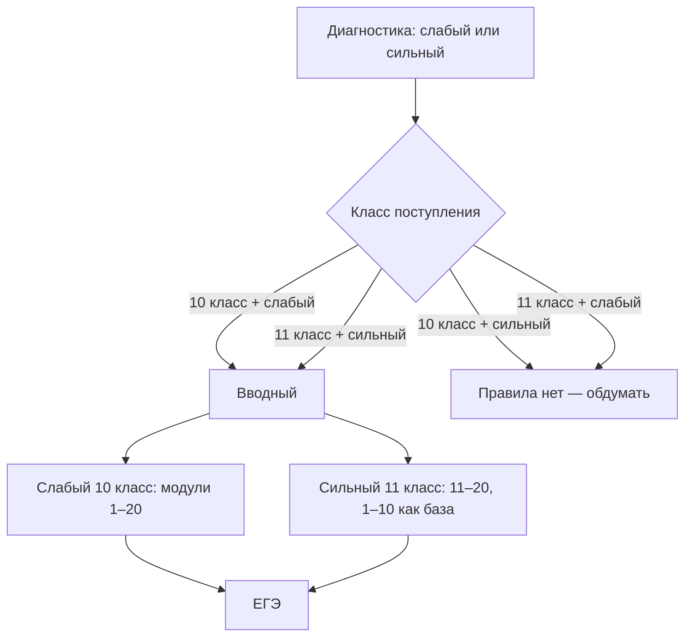

# Курс подготовки к ЕГЭ по английскому языку

Структурированное описание курса на основе текущих материалов автора.  
Исходники сохранены в [`06-sources/`](06-sources/). Предложения, которых ещё нет в исходниках, помечены как **черновик**.

## Как устроен этот пакет

| Папка | Содержание |
| --- | --- |
| [00-architecture](00-architecture/course-map.md) | Два года, 20 модулей, вводный модуль, диагностика, маршрут ученика |
| [01-exam](01-exam/exam-structure.md) | Формат ЕГЭ, баллы, критерии 37 / 38 / устная часть |
| [02-content-spec](02-content-spec/overview.md) | Кодификатор: лексика, грамматика, фонетика, темы, что проверяется |
| [03-curriculum](03-curriculum/module-index.md) | Сетка модулей 0–20 и накопительный список тем для тьютора |
| [04-intro-video](04-intro-video/slides.md) | Слайды и речь эксперта для вводного видео |
| [05-tutor-ops](05-tutor-ops/feedback-principles.md) | Принцип фидбека и бланки проверки 37 / 38 / задания 4 |
| [06-sources](06-sources/) | Очищенные исходные документы |
| [GAPS.md](GAPS.md) | Чего ещё нет; матрица сила × класс |

Машиночитаемая карта курса: [`curriculum.yaml`](curriculum.yaml).

## Одна страница: логика курса

- Курс рассчитан на **два года**: базовый (1–10) и продвинутый (11–20).
- **Вводный модуль один** для всех.
- **Идеал:** слабый 10-классник — с модуля 1; сильный 11-классник — с модуля 11, модули 1–10 как база.
- **Пока нет ответа:** сильный 10-классник и слабый 11-классник — см. [GAPS.md](GAPS.md).

## Одна страница: логика модуля

Каждый рабочий модуль (1–20) состоит из двух фаз.

1. **Receptive (восприятие)**  
   Лексика, грамматика, словообразование, стратегии чтения и аудирования, фонетика. Теория + тренажёры.
2. **Productive (применение)**  
   Практика речи в Zoom → три задания тьютору (письмо 37, эссе 38 в официальном стиле по таблице или диаграмме, говорение 4) → итоговый тест с автопроверкой.

Критерии **РКЗ** и **организация** проверяются полностью с первой сдачи тьютору.  
**Язык** (лексика, грамматика, фонетика) проверяется **накопительно**: комментируем только пройденное.

## Статус материалов

| Блок | Статус |
| --- | --- |
| Архитектура курса (2 года, 20 модулей, вводный) | Есть. Идеал: слабый 10 → с 1; сильный 11 → с 11 + база 1–10 |
| Размещение сила × класс | Две клетки не решены: сильный в 10-м, слабый в 11-м |
| Структура ЕГЭ и критерии 37 / 38 / задания 4 | Есть |
| Накопительный принцип фидбека | Есть |
| Шаблоны тьютора | Есть |
| Вводное видео (слайды + речь) | Есть, без примеров работ. Речь общая для года 1 и года 2 |
| Полный перечень элементов кодификатора | Есть. 38 = эссе в официальном стиле по таблице или диаграмме, CV нет |
| Распределение элементов по модулям 1–20 | **Черновик сетки** — авторского посемейного плана ещё нет |
| Диагностический тест и пороги | Нет. Матрица сила × класс: две клетки открыты |
| Лексические минимумы, уроки Zoom, тренажёры | Нет |
