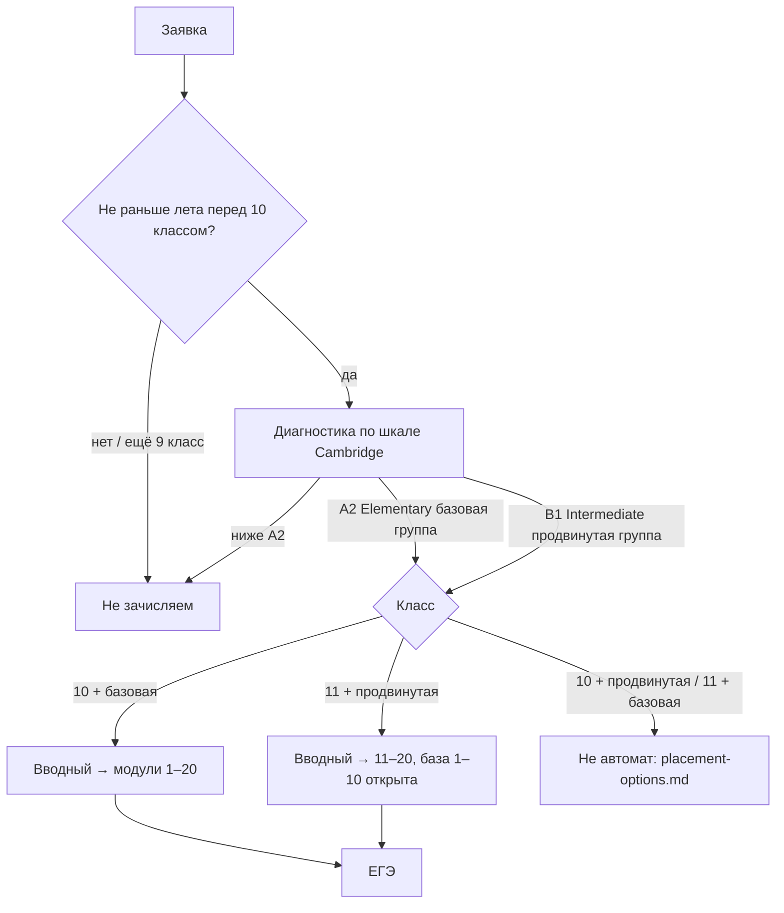

# Курс подготовки к ЕГЭ по английскому языку

Структурированное описание курса на основе текущих материалов автора.  
Исходники сохранены в [`06-sources/`](06-sources/). Предложения, которых ещё нет в исходниках, помечены как **черновик**.

## Как устроен этот пакет

| Папка | Содержание |
| --- | --- |
| [00-architecture](00-architecture/course-map.md) | Два года, 20 модулей, вводный, диагностика Cambridge, [группы A2/B1](00-architecture/how-we-speak.md), [роли](00-architecture/roles.md), [косые клетки](00-architecture/placement-options.md) |
| [01-exam](01-exam/exam-structure.md) | Формат ЕГЭ, баллы, критерии 37 / 38 / устная часть |
| [02-content-spec](02-content-spec/overview.md) | Кодификатор: лексика, грамматика, фонетика, темы, что проверяется |
| [03-curriculum](03-curriculum/module-index.md) | Сетка 0–20 **утверждена**; [расширенная таблица](03-curriculum/curriculum-detailed.md); [вводный для ученика](03-curriculum/intro-module.md); [Россия](03-curriculum/russia-strand.md); [English World](03-curriculum/english-world-strand.md) |
| [04-intro-video](04-intro-video/slides.md) | Слайды и речь эксперта для вводного видео |
| [05-tutor-ops](05-tutor-ops/feedback-principles.md) | Принцип фидбека и бланки проверки 37 / 38 / задания 4 |
| [06-sources](06-sources/) | Очищенные исходные документы |
| [GAPS.md](GAPS.md) | Чего ещё нет; матрица группа × класс |
| [pdf](pdf/INDEX.pdf) | PDF-снимки всех текущих файлов; целиком — [_полный-пакет.pdf](pdf/_полный-пакет.pdf) |

Машиночитаемая карта курса: [`curriculum.yaml`](curriculum.yaml).

## Одна страница: логика курса

- Курс рассчитан на **два года**: базовый (1–10) и продвинутый (11–20).
- **Вводный модуль один** для всех.
- **Отсев:** ниже A2 и/или раньше лета перед 10 классом.
- **Группы:** A2 / Elementary / базового уровня — с модуля 1; B1 / Intermediate / продвинутого уровня — с модуля 11, **1–10 всегда открыты**. Как говорим: [how-we-speak.md](00-architecture/how-we-speak.md).
- **Пока нет маршрута:** B1 в 10 классе и A2 в 11 классе — [placement-options.md](00-architecture/placement-options.md).

## Одна страница: логика модуля

Каждый рабочий модуль (1–20) состоит из двух фаз.

1. **Receptive (восприятие)**  
   Лексика, грамматика, словообразование, стратегии чтения и аудирования, фонетика (один шаг), лонгрид «Россия», блок English World (три коротких текста про англоязычные страны) — теория + автопроверка.
2. **Productive (применение)**  
   Практика речи в Zoom → три задания тьютору (письмо 37, эссе 38 в официальном стиле по таблице или диаграмме, говорение 4) → итоговый тест с автопроверкой.

Критерии **РКЗ** и **организация** проверяются полностью с первой сдачи тьютору.  
**Язык** (лексика, грамматика, фонетика) проверяется **накопительно**: комментируем только пройденное.

## Статус материалов

| Блок | Статус |
| --- | --- |
| Архитектура курса (2 года, 20 модулей, вводный) | Есть. Сетка **утверждена**. Кто с 11-го модуля — 1–10 всегда открыты |
| Размещение группа × класс | Отсев и идеалы зафиксированы. Две косые клетки: варианты есть, маршрута нет |
| Структура ЕГЭ и критерии 37 / 38 / задания 4 | Есть |
| Накопительный принцип фидбека | Есть |
| Шаблоны тьютора | Есть |
| Вводное видео (слайды + речь) | Есть. Речь общая для года 1 и года 2 |
| Вводный модуль для ученика | Презентация + [речь эксперту](03-curriculum/intro-student/presentation-script.md); [памятка родителям](03-curriculum/intro-student/parent-guide.md); обзор заданий; бланки; 37 / 38 / говорение 1–4 |
| Полный перечень элементов кодификатора | Есть. 38 = эссе в официальном стиле по таблице или диаграмме, CV нет |
| Распределение элементов по модулям 1–20 | **Утверждено.** [curriculum-detailed.md](03-curriculum/curriculum-detailed.md) |
| Слой «Россия» | Раскладка на 20 лонгридов есть; тексты ещё не написаны |
| Слой «English World» | Раскладка: 3 коротких текста × 20 модулей; тексты ещё не написаны |
| Слой «фонетика» | Шаги 1–20 по порядку кодификатора заданы |
| Диагностический тест и cut-off середины B1 | Шкала Cambridge и отсев зафиксированы. Теста нет. Косые клетки открыты |
| Лексические минимумы, уроки Zoom, тренажёры | Нет |
